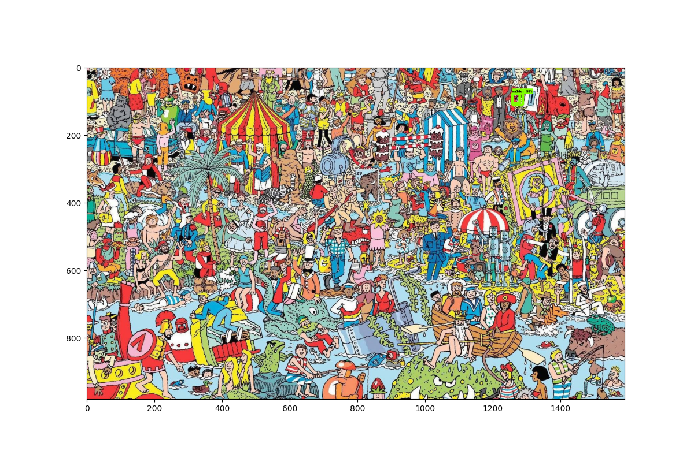

# waldo-is-right-there
Author: Richard Li
Training dataset comes from [this lovely repository](https://github.com/vc1492a/Hey-Waldo/tree/master/64/notwaldo)

[This reference repository](https://github.com/tadejmagajna/HereIsWally) gave me pretty much all of the components of the model that I needed to run this project. Because this project was primarily for understanding and not implementation, it was invaluable to me. 

# Table of Contents
- [waldo-is-right-there](#waldo-is-right-there)
- [Table of Contents](#table-of-contents)
  - [Run:](#run)
  - [Goal](#goal)
  - [Solving the problem](#solving-the-problem)
  - [Design Decision](#design-decision)
  - [Challenges](#challenges)
  - [Improvements](#improvements)
  - [Lessons](#lessons)
  - [Conclusion](#conclusion)

## Run:

I ran all of this in a virtual environment, but `pipenv` was being very non-cooperative (see [Challenges](#Challenges)). I ended up just `pip install`ing within the `pipenv`, which I should've been able to avoid via `pipenv install`, but I just didn't have enough time to debug all of my issues.

Installs (because `pipenv` doesn't work)
`pipenv shell`
`pip install tensorflow==1.15.4`
`pip install matplotlib`
`pip install pillow`

Then, run `find.py` (you can change paths within the python file as necessary)

## Goal

This project is a Waldo finder (from Where's Waldo). Given an image where Waldo is present, draw a box around Waldo!

The goal of this project was for me to get a better understanding of what neural networks need in order to run. I've done a lot of work benchmarking the results of these kinds of models, but have never tried implementing them myself. I just wanted to get an idea of implementation process + what part of this is difficult. In particular, I didn't care if I even trained the model myself or anything, since I have no idea how challenging it can be to get a model working, even if I borrow an existing library to do it.

## Solving the problem

We'll begin with the crux of this project: what does a ML model need in order to work? 

Generally, data. Lots and lots of *labelled* data. Thankfully, somebody put in the effort to hand label a bunch of *Where's Waldo* puzzles, so we didn't have to do any of that work. But this is most of the effort that goes in to setting up ML models, which is kind of boring but true.

Then, a structure for our model. We're using a *convolutional neural network*, or CNN, which works best on images because convolution (and some other things CNNs use) allow us to downsample images and get more accurate data, faster. In particular, I'm using Tensorflow (which is a python framework that is specifically designed for ML). 

From here, we want to take our jpgs and labels and compress them into `.tfrecords` files (this is just a super size-efficient way to do this). Because this is Tensorflow-specific, there's a defined process for doing this that is essentially turning images into byte arrays. After this, we technically have everything we need to pipe into our CNN:

Admittedly, I don't *really* understand what's happening when a CNN is learning (i.e. forward/backpropogation, etc.), but here's a high-level explanation:

1. We intialize a model with randomized "weights" (or in our case, because we're using transfer learning, less-than-random weights)
2. At every interval, the network evaluates and predicts our target (where Waldo is) before evaluating its error. Over time, it will make predictions that make this error threshhold as low as possible -- in other words, gradient descent!
3. Gradually, over many iterations, we approach a loss that is negligible and determine that our model is now capable of identifying our target pretty much spot on.

*Note: from nothing to a working model, this could take ages. We sped this process up with [transfer learning](#design-decision)!*

Afterwards, we have our model, which is a blurred way of saying a bunch of weights that are tuned to find Waldo in a picture. Now, how can we use it to find Waldo? The testing process is essentially just using an existing Tensorflow class `Session` to run with our detection graph that we spawn from the model itself. Again, also a super methodical process (and perhaps Tensorflow specific?) 

From here, I have some eval images in `assets/eval/` that we can test on to find Waldo! 

 *NOTE THE GREEN SQUARE ON WALDO IN THE TOP RIGHT CORNER!*

## Design Decision

I was not interested in actually code the muscle of the model itself, so I used an RCNN model out of the box from Tensorflow. I learned that I could use *transfer learning* to sort of borrow the progress an existing model has already made to shorten the amount of time it takes for my model to converge. In the end, I even decided to just steal the weights of an existing waldo-finder model, because I could explain what I needed to train a model but hadn't worked out the dependency hell necessary to make it happen.

Something that I had to get comfortable with in order to push this project over the finish line was getting comfortable copying other people for the sake of learning. I did not (and do not) claim that this project is novel in any way, but it was useful for my own understanding.

## Challenges

I did not expect to have as much using Tensorflow as I did. With it being such a common ML library, I figured that it'd be really easy for me to just plug and play with it, but I couldn't figure out the way that these dependencies needed to work, even after understanding what configuration/checkpoints were used where. 

I'll avoid getting into too much detail, but `pipenv` wasn't working, and `matplotlib`'s visualizer wasn't wroking... basically every dependency that needed to work wasn't working, which is why the scope of this project is so much less impressive than what it really should be. Honestly, this ended up eating up most of my time, and it was both frustrating and scary to pretty much have nothing to show all the way until the end of the project. The fact that this ate up so much of my time also meant that I didn't get to play around with my model as much as I wanted to before the deadline. 

Aside from this challenge, which was largely unexpected, the challenge that I faced was developing an understanding of all of the components that go into an ML model. It's hard to explain where I was at the beginning of this project, because it wasn't square 0, but it was pretty close. I didn't understand how labelling worked, how models processed them, etc. This really was just an excuse to flip some levers I've always wanted to flip. 

## Improvements

First thing's first. The model doesn't work *that* well. The `eval/` images I included work with the model, but randomly pulling an image off the web and running it generally leads to failure. I don't know if this is due to quality issues or model issues, but that's something I'd like to improve. 

To improve this project, I would like to now write the underlying CNN that is training the data. This would undoubtedly give me more control over the parameters and give me a bunch of opportunities to both optimize and develop a greater understanding of what is actually happening when a machine "learns".

But that's a bit of an aggressive improvement. The smaller improvements I'd like to make all kind of follow the same trend though: writing and implementing various parts of the project myself that I took from the internet. For instance, writing the script to generate the `.tfrecords` binary that the model uses to train or writing the script to generate the annotations file. 

I think I have a good understanding of what needs to happen before I can pull the trigger on training a model myself, so when I have the compute power and time, I'd like to do it myself. 

## Lessons

This was the first time I did a project solely with the intention of just seeing how a black box takes inputs and gives outputs, rather than a project to better understand the black box itself. I've learned that I should start as basic as possible, and copy or hard-code as many things as necessary to get things to work, before trying to generate the various inputs I need. 

For instance, I spent a lot of time trying to write the script to generate the `.tfrecords` file, when I could've just copied a `.tfrecords` file off the internet and figured out the dependency issues earlier.

## Conclusion
All in all, I'm not 100% satisfied with this project, but it's a place for me to come back to and improve in the future. I already mentioned some things I'd like to do next, but this learning process still taught me a lot. I would say it was generally a success.
